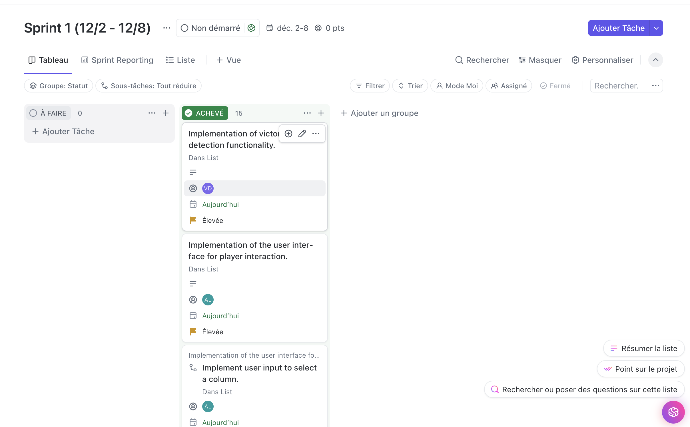
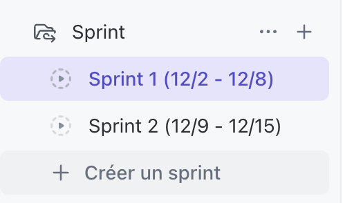

# 🎮 Puissance 4 - Jeu en Ligne de Commande

Bienvenue dans notre projet **Puissance 4**, un jeu interactif en ligne de commande développé par une équipe de 5 passionnés ! Ce projet met en avant non seulement nos compétences en Python, mais aussi une méthodologie de gestion de projet efficace en utilisant **ClickUp** et les bonnes pratiques Git. 🚀

---
## 🗂️ Organisation et Méthodologie

### 🛠️ **Outil de Gestion : [ClickUp](https://app.clickup.com/9012547742/v/s/90122239379)**
Pour organiser notre travail collaboratif, nous avons utilisé **ClickUp** comme outil principal. Grâce à ses fonctionnalités, nous avons pu :
- Répartir les tâches selon les rôles définis pour chaque membre.  
- Suivre l'avancement du projet via des tableaux Kanban.  
- Définir les deadlines et prioriser les tâches.  
- Faciliter la communication et la collaboration au sein de l'équipe. 
- Mettre en place des sprints



🎯 Chaque tâche correspondait à une fonctionnalité (comme la gestion de la grille, la logique du jeu, etc.) et a été suivie jusqu'à sa finalisation avant d'être fusionnée dans les branches Git appropriées.

### 🌲 **Workflow Git**
Nous avons utilisé un workflow Git structuré avec trois branches principales :
1. **`dev`** : Développement actif. Chaque fonctionnalité est développée dans une branche `feature/*` issue de `dev`.  
2. **`stage`** : Intégration et tests finaux avant livraison en production.  
3. **`prod`** : Version stable et jouable du projet.

Les conventions de commit suivent le format :  

Exemple : `feat(grid): Initialisation de la classe Grid`

---
type(scope): message

## 🔍 Fonctionnement du Jeu

### 📖 **Règles du Puissance 4**
Le but du jeu est d'aligner 4 jetons de sa couleur, horizontalement, verticalement ou en diagonale, dans une grille de **7 colonnes et 6 lignes**.

### 🚀 **Comment Jouer ?**
1. Lancez le programme depuis la ligne de commande.  
2. Les joueurs jouent chacun leur tour en choisissant une colonne où déposer leur jeton.  
3. Le jeu détecte automatiquement les victoires ou les égalités.  
4. Amusez-vous ! 🎉

---
"""
"""
## 📂 Structure du Projet

Voici un aperçu des fichiers et modules de notre projet :

puissance4/
├── grid.py               # Gestion de la grille
├── game_logic.py         # Mécanique du jeu
├── victory_conditions.py # Détection des victoires
├── interface.py          # Interface utilisateur (CLI)
├── tests/                # Tests unitaires pour chaque composant
│   ├── test_grid.py
│   ├── test_game_logic.py
│   ├── test_victory_conditions.py
│   ├── test_interface.py
├── README.md             # Documentation du projet
├── main.py               # Point d’entrée principal

---

## 🛠️ Installation et Lancement

### 1️⃣ **Prérequis**
Assurez-vous d'avoir **Python 3.8+** installé sur votre machine.

### 2️⃣ **Cloner le projet**
    ```bash
    git clone https://github.com/robinVincent1/puissance4-project-IDO.git
    cd puissance4
    ```
### 3️⃣ **Lancer le jeu**
    ```bash
    python main.py
    ```
## 🧪 Tests

Pour garantir la qualité et la stabilité du projet, nous avons inclus des tests unitaires pour chaque module.
Pour exécuter tous les tests :

    ```bash
    python -m unittest discover tests
    ```

## 💡 Fonctionnalités Implémentées

- 🟦 **Grille Dynamique** : Gestion de la grille avec affichage en ligne de commande.
- 🔄 **Mécanique de Jeu** : Ajout de jetons, alternance des joueurs et gestion des colonnes pleines.
- ✅ **Détection des Victoires** : Identification des alignements horizontaux, verticaux et diagonaux.
- 🎮 **Interface Utilisateur** : Interaction fluide via la console.
- 🧪 **Tests Unitaires** : Vérification complète de la stabilité du jeu.

---

## 👥 Équipe de Développement

Voici les rôles et responsabilités de chaque membre de l'équipe :

| 🧑‍💻 **Membre**     | 🎯 **Rôle**                    | ✨ **Contribution**                      |
|----------------------|-------------------------------|------------------------------------------|
| **Robin Vincent**    | Gestion de la grille          | Implémentation et tests de la grille     |
| **Lilian Monnereau** | Mécanique de jeu              | Gestion des jetons et alternance         |
| **Dubuc Vincent**    | Détection des victoires       | Vérification des conditions de victoire  |
| **Alexandre Lagorce**| Interface utilisateur         | Interaction et gestion des tours         |
| **Romain Mezghenna** | Tests et validation           | Tests unitaires et script de validation  |

---

## 📄 Licence

Ce projet est sous licence libre

---

## 🎉 Merci d'avoir joué !

Nous espérons que vous apprécierez notre implémentation du Puissance 4. Pour toute question ou suggestion, n'hésitez pas à nous contacter ou à soumettre une issue sur le dépôt GitHub. 😄
ests Unitaires : Vérification complète de la stabilité du jeu.**